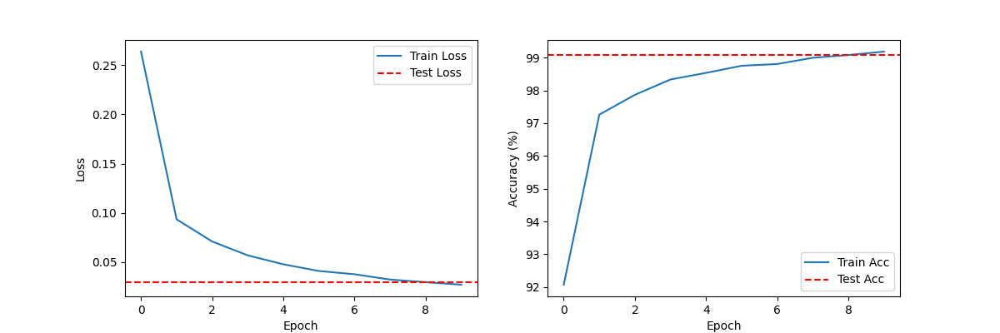
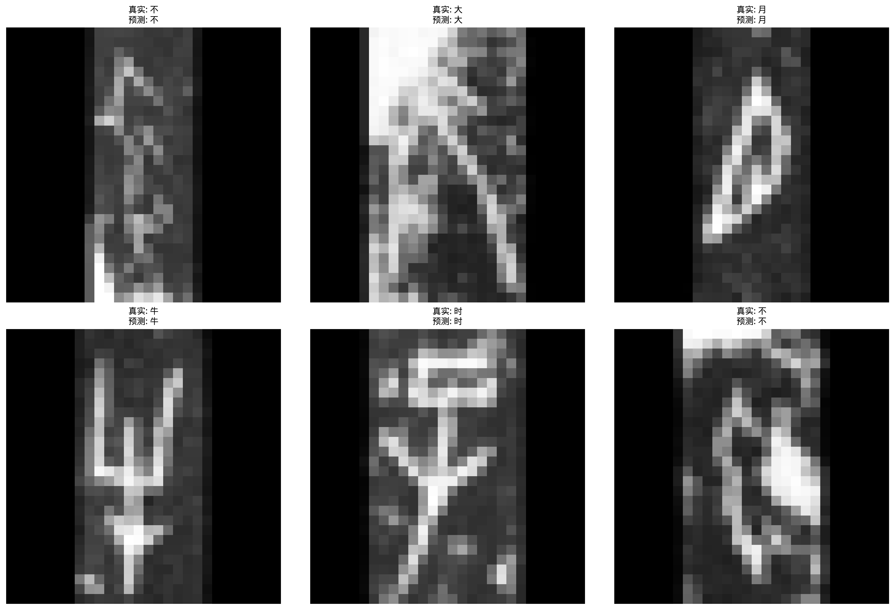

# Oracle-MNIST CNN Classifier

## 项目简介
本项目是一个基于轻量级卷积神经网络（CNN）的手写字符分类器，使用 **Oracle-MNIST** 数据集进行训练和测试。Oracle-MNIST 是一个开源数据集，包含了类似 MNIST 的手写字符图像，适用于图像分类任务。

## 数据集说明
本项目所使用的 **Oracle-MNIST** 数据集为开源数据集，供研究和教学使用。数据集格式与标准 MNIST 数据集一致，包含 28×28 灰度手写字符图像。

请确保数据集的使用符合其许可协议，并尊重原始数据集提供者的权益。

## 依赖环境
本项目基于 `PyTorch` 进行模型训练，使用 Python 3.13.2 版本，并安装以下依赖项：

```bash
pip install torch torchvision numpy matplotlib pillow
```

## 代码结构
```
.
├── data/                  # 存放 Oracle-MNIST 数据集
├── src/
│   ├── mnist_reader.py    # 读取 MNIST 格式的数据集
│   ├── dataset.py         # 定义 PyTorch Dataset 类
│   ├── model.py           # 定义 CNN 模型
│   ├── train.py           # 训练模型
│   ├── evaluate.py        # 评估模型
├── oracle_cnn.pth         # 训练好的模型
├── README.md              # 项目说明文件
```

## 运行方式
### 1. 数据准备
请下载 Oracle-MNIST 数据集，并解压到 `data/` 目录下。数据文件应包含：
- `train-images-idx3-ubyte.gz`
- `train-labels-idx1-ubyte.gz`
- `t10k-images-idx3-ubyte.gz`
- `t10k-labels-idx1-ubyte.gz`

### 2. 训练模型
运行以下命令以训练 CNN 模型：

```bash
python src/train.py
```

### 3. 评估模型
训练完成后，可使用以下命令评估模型的准确性：

```bash
python src/evaluate.py
```

## 训练结果
训练过程中，损失函数和准确率的变化如下图所示：



测试集结果如下图所示


## 许可证
本项目遵循 MIT 许可证，具体内容请参考 `LICENSE` 文件。

**数据集来源**：请参考 Oracle-MNIST 官方页面，并确保使用符合其许可要求。
